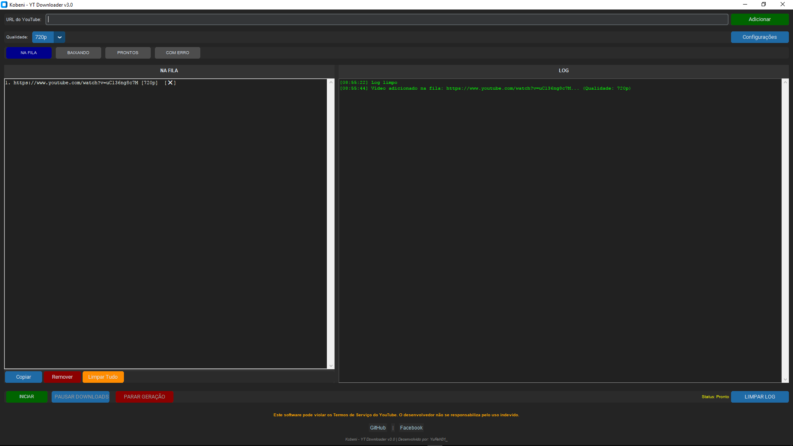

<h1>Kobeni - YT Download v3</h1>

<p align="center">
  <em>Este projeto foi desenvolvido com foco em estudo e uso pessoal.</em><br>
  É uma ferramenta de automação para download de vídeos e músicas do YouTube,<br>
  priorizando simplicidade, controle local e estabilidade.
</p>

<p align="center">
  
  
  
</p>

---

## ⚙️ Tecnologias utilizadas

- **Python 3.12**
- **Requests** – comunicação HTTP
- **CustomTkinter** – interface gráfica simples
- **aria2c** – gestor de downloads (downloads paralelos e estáveis)
- Outras bibliotecas padrão do Python

> ⚠️ **A versão atual não utiliza Selenium.**  
> Todo o processo funciona exclusivamente via requests.

---

## 🚀 O que o programa faz

✨ **Principais funcionalidades:**

- Gera links diretos de download a partir de vídeos do YouTube
- Suporta múltiplas qualidades:
  - **Vídeo:** 144p até 1080p
  - **Áudio:** 48k e 128k
- Realiza downloads paralelos usando o **aria2c**
- Permite colar vários links e deixar o processo rodando sem supervisão
- Renomeia corretamente os arquivos após o download
- Salva informações dos vídeos localmente em JSON

---

## 📦 Como usar

### 🔹 Versão pronta (recomendada)

Se você apenas quer usar o programa, **sem modificar o código**:

👉 **[Download do executável (.exe)](github.com/YuReN31/Kobeni_YT/assets/)**

> Não é necessário instalar Python nem dependências.

### 🔹 Versão para desenvolvedores

Se quiser estudar, modificar ou adaptar o projeto:

👉 **[Repositório do projeto](github.com/YuReN31/Kobeni_YT/code)**

**Passos:**

1. Clone o repositório:
```bash
   git clone https://github.com/YuReN31/Kobeni_YT
```

2. Instale as dependências:
```bash
   pip install -r requirements.txt
```

3. Execute o programa:
```bash
   python main.py
```

---

## 🖥️ Interface

<p align="center">
  
</p>

---

## ℹ️ Informações importantes
- 📁 Pasta padrão de download: `C:\Users\UserName\Downloads\YT Downloads`
- 🔄 Downloads continuam mesmo após erros

---

## ❓ Perguntas frequentes (Eu acho)

### 🔐 Algum dado é coletado?

**Não.**

- Nenhuma informação pessoal é enviada para servidores externos
- O único dado enviado é o link do vídeo do YouTube, utilizado exclusivamente para gerar o download
- Todas as informações dos vídeos são armazenadas **localmente no seu PC**

### ⚖️ Isso é um serviço legítimo?

**Depende do uso.**

✅ Para uso próprio, não há problema

❌ **Não me responsabilizo por:**
- Redistribuição de conteúdo protegido
- Uso comercial
- Violação de direitos autorais

> O projeto é **educacional e experimental**.

---

## 👀 Observações finais

Este projeto foi criado:
- 📚 Para aprendizado prático
- 🚫 Não é nenhum tipo de produto comercial
- 🔧 É apenas uma ferramenta

---

<p align="center">
  Feito por <strong>YuReN31_</strong><br>
  com muito <s>amor</s> cansaço ☕
</p>

<p align="center">
  <a href="https://github.com/YuReN31_">
    
  </a>
</p>
